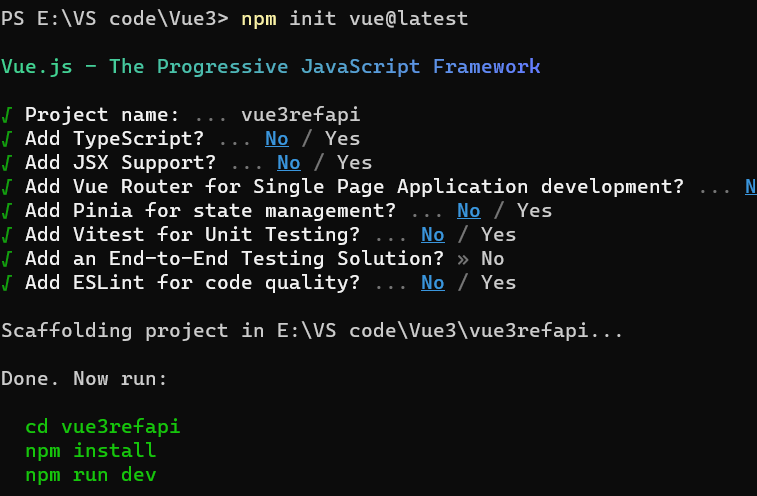

# vue3refapi

This is the basic project demonstrating use of 'ref' api in vue 3

# Prerequisites
1) This project runs on Node version 18.16.0 and npm version 9.5.1 and Vue js 3

# How this project is created
1) run command - npm init vue@latest
2) Follow the below sequence

This project uses basic html and css to show how we can use 'ref' api with simple primitive values.

# How to run this project

1) Clone the repository on your local machine.
2) Open Windows Terminal or command prompt and go to the project location.
3) Run the following command
    -npm install
    -npm run dev
4) Open the given link in the browser.